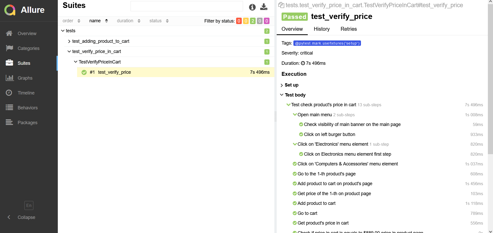
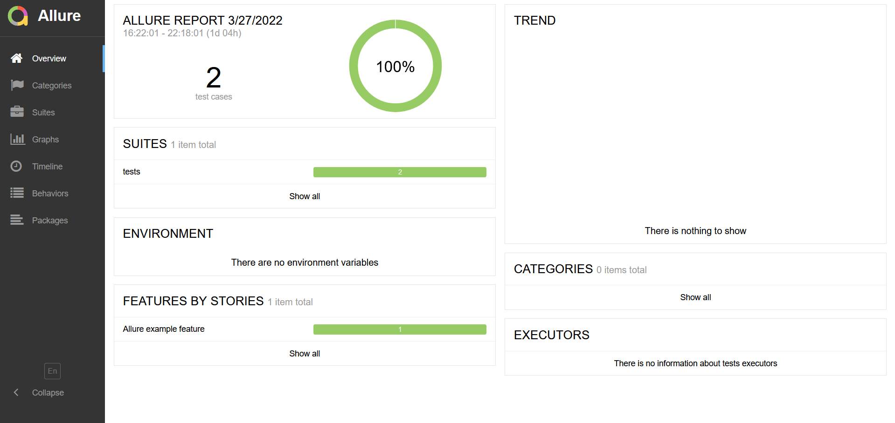

**Installation of virtual environment and dependencies**:
Execute in the terminal in the main project directory (or in the PyCharm terminal):
- Add a virtual environment: **python -m venv venv**
- Activate the environment: **venv\Scripts\activate.bat**
- Install all dependencies: **install pip -r requirements.txt**

# Launch:

**pytest marlow_navigation/tests --url=Site name --alluredir=marlow_navigation/allure_results**
**python marlow_navigation/tests --url=Site name --alluredir=Site name/allure_results**

# Generation from the report:
**allure generate allure_results --clean**

**-с, --clean**: Clearing the previous report before generating a new one

https://docs.qameta.io/allure/

#Launch Options:

--alluredir=marlow_navigation/allure_results Running tests, creates a directory
in which files for generating the report will be created

**--remote=true**: Running tests on a remote server

**--url=URL**: where URL is the link of the test site

**--headless=true**: Running tests without displaying browsers

**-n num**: Parallel running of tests, where the number is the number of parallel running test threads
automatic starts or number of threads depending on physical and logical processors

**-k "" collect-only**: Displays a list of all tests available to run.
In quotation marks, you can specify the name of the class or test for which you want to output a list of tests
 
**-x, --exitfirst**: Running tests before the first dropped test

**--maxfail=num**: Running tests up to the number of dropped tests

**--lf, --last-failed**: Restarting only dropped tests

**--ff, --failed-first**: Restarting the fallen tests first, then all remaining

**-q, --quiet**: Without a test log, only the overall result of the tests is displayed

**-v, --verbose**: Extended test log, adds PASSED WITH ERROR to the log

**--tb=**: Test log output: *auto/long/short/line/native/no* ,  order by output reduction

**-l, --showlocals**: Displays local variables next to the stack trace

**-rsxX**:  to mark which tests are skipped, xfailed, or xpassed

The result should be a report of the form:

